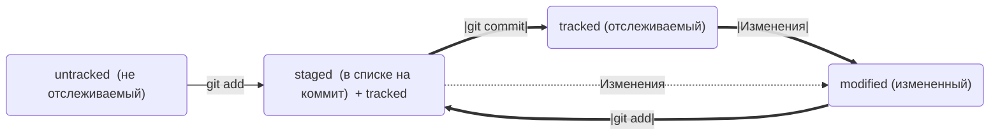

# Этот репозиторий создан для моего друга N. В нем предсталенна краткая информация по основам работы с командной строкой и git.
Кроме того, не буду кривить душой, сам буду использовать его в качестве шпаргалки, до тех пор, пока **_эти команды не начнут мне снится_**.
~~Желательно в сладких снах, а не в кошмарах~~


# Навигация
* ```pwd``` (от англ. print working directory, «показать рабочую папку») — покажи, в какой я папке;
* ```ls``` (от англ. list directory contents, «отобразить содержимое директории») — покажи файлы и папки в текущей папке;
* ```ls -a``` — покажи также скрытые файлы и папки, названия которых начинаются с символа .;
* ```cd first-project``` (от англ. change directory, «сменить директорию») — перейди в папку first-project;
* ```cd first-project/html``` — перейди в папку html, которая находится в папке first-project;
* ```cd ..``` — перейди на уровень выше, в родительскую папку;
* ```cd ~``` — перейди в домашнюю директорию (/Users/Username);
* ```cd /``` — перейди в корневую директорию.

---

# Работа с файлами и папками
## Создание
* ```touch index.html``` (англ. touch, «коснуться») — создай файл index.html в текущей папке;
* ```touch index.html style.css script.js``` — если нужно создать сразу несколько файлов, можно напечатать их имена в одну строку через пробел;
* ```mkdir second-project``` (от англ. make directory, «создать директорию») — создай папку с именем second-project в текущей папке.
## Копирование и перемещение
* ```cp file.txt ~/my-dir``` (от англ. copy, «копировать») — скопируй файл в другое место;
* ```mv file.txt ~/my-dir``` (от англ. move, «переместить») — перемести файл или папку в другое место.
## Чтение
* ```cat file.txt``` (от англ. concatenate and print, «объединить и распечатать») — распечатай содержимое текстового файла file.txt.
## Удаление
* ```rm about.html``` (от англ. remove, «удалить») — удали файл about.html;
* ```rmdir images``` (от англ. remove directory, «удалить директорию») — удали папку images;
* ```rm -r second-project``` (от англ. remove, «удалить» + recursive, «рекурсивный») — удали папку second-project и всё, что она содержит.

---

# Работа с git

## Инициализация репозитория
* ```git init``` (от англ. initialize, «инициализировать») — инициализируй репозиторий.
## Подготовка файла к коммиту
* ```git add todo.txt``` (от англ. add, «добавить») — подготовь файл todo.txt к коммиту;
* ```git add --all``` (от англ. add, «добавить» + all, «всё») — подготовь к коммиту сразу все файлы, в которых были изменения, и все новые файлы;
* ```git add .``` — подготовь к коммиту текущую папку и все файлы в ней.
## Создание коммита
* ```git commit -m "Комментарий к коммиту."``` (от англ. commit, «совершать», «фиксировать» + message, «сообщение») — сделай коммит и оставь комментарий, чтобы было проще понять, какие изменения внесены.
## Просмотр информации о коммитах
* ```git log``` (от англ. log, «журнал [записей]») — выведи подробную историю коммитов.
* ```git log --oneline``` (англ. «одной строкой») — вызывает сокращённый лог. При этом в терминале появятся только 
первые несколько символов хеша каждого коммита и комментарии к ним.
## Просмотр состояния файлов
* ```git status``` (от англ. status, «статус», «состояние») — покажи текущее состояние репозитория.

## Синхронизация локального и удалённого репозиториев
* ```git remote add origin https://github.com/YandexPracticum/first-project.git``` (от англ. remote, «удалённый» + add, «добавить») — привяжи локальный репозиторий к удалённому с URL https://github.com/YandexPracticum/first-project.git;
* ```git remote -v``` (от англ. verbose, «подробный») — проверь, что репозитории действительно связались;
* ```git push -u origin main``` (от англ. push, «толкать») — в первый раз загрузи все коммиты из локального репозитория в удалённый с названием origin.

# Копирование чужих репозиториев
## Клонирование
* ```git clone git@github.com:TheGreatOwner/the-great-project.git``` (от англ. clone, «клон», «копия») — склонируй репозиторий с URL the-great-project.git из аккаунта TheGreatOwner на мой локальный компьютер.
## «Форк»
* «Форк» — операция, которая не связана с Git напрямую и выполняется через графический интерфейс GitHub (кнопка Fork в правом верхнем углу страницы репозитория). «Форк» создаёт независимую копию репозитория со всеми файлами, коммитами и ветками в аккаунте GitHub. Такая копия будет полностью независима. Внесённые изменения не будут синхронизированы с исходным репозиторием.

---

# Хеш коммита
Информация о коммите хранится в **хеше коммита**. Когда был сделан коммит, Git сохраняет содержимое файлов в репозитории на момент коммита 
и ссылку на родительский коммит и получает для каждого коммита свой уникальный хеш — **результат хеширования**.  

Результат хеширования в Git — символьная строка. Она относительно коротка (40 символов в случае SHA-1) и состоит из цифр
0-9 и латинских букв A-F (неважно, заглавных или строчных). Хеш обладает следующими важными свойствами:  
* если хеш получить дважды для одного и того же набора входных данных, то результат будет гарантированно одинаковый;
* если хоть что-то в исходных данных поменяется (хотя бы один символ), то хеш тоже изменится (причём сильно).  

Git хранит таблицу соответствий `хеш -> информация о коммите`. Если известен хеш, можно узнать всё остальное: автора и дату
коммита и содержимое закоммиченных файлов. Можно сказать, что хеш — основной идентификатор коммита.  
Все хеши и таблицу `хеш → информация о коммите` Git сохраняет в служебные файлы. Они находятся в скрытой папке 
`.git` в репозитории проекта.

# HEAD
Файл **HEAD** (англ. «голова», «головной») — один из служебных файлов папки `.git`. Он указывает на коммит, который 
сделан последним (то есть на самый новый).  
Внутри **HEAD** — ссылка на служебный файл: `refs/heads/master` (или `refs/heads/main` в зависимости от названия ветки).
Если заглянуть в этот файл, можно увидеть хеш последнего коммита.  

**_Пример:_**  
`$ cat refs/heads/master # взяли ссылку из файла HEAD`  
`e007f5035f113f9abca78fe2149c593959da5eb7 # внутри файла`  

# Статусы коммита

Одна из ключевых задач Git — отслеживать изменения файлов в репозитории. Для этого каждый файл помечается каким-либо 
статусом. Основные:
* _**untracked**_ (англ. «неотслеживаемый»). Новые файлы в Git-репозитории помечаются как untracked, то есть неотслеживаемые. 
Git «видит», что такой файл существует, но не следит за изменениями в нём. У untracked-файла нет предыдущих версий, 
зафиксированных в коммитах или через команду `git add`.
* _**staged**_ (англ. «подготовленный»). После выполнения команды `git add` файл попадает в staging area
(от англ. stage — «сцена», «этап [процесса]» и area — «область»), то есть в список файлов, которые войдут в коммит. 
В этот момент файл находится в состоянии staged.
* _**tracked**_ (англ. «отслеживаемый»). Состояние tracked — это противоположность untracked. Оно довольно широкое по смыслу:
в него попадают файлы, которые уже были зафиксированы с помощью git commit, а также файлы, которые были добавлены в
staging area командой git add. То есть все файлы, в которых Git так или иначе отслеживает изменения.
* _**modified**_ (англ. «изменённый»). Состояние modified значит, что Git сравнил содержимое файла с последней 
сохранённой версией и нашёл отличия. Например, файл был закоммичен и после этого изменён.

## Типичный жизненный цикл файла в Git



